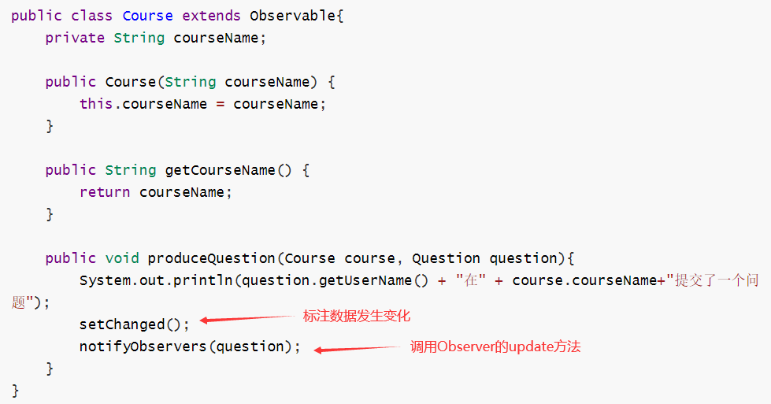
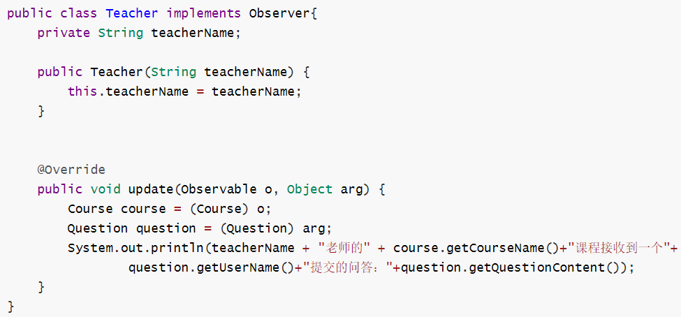
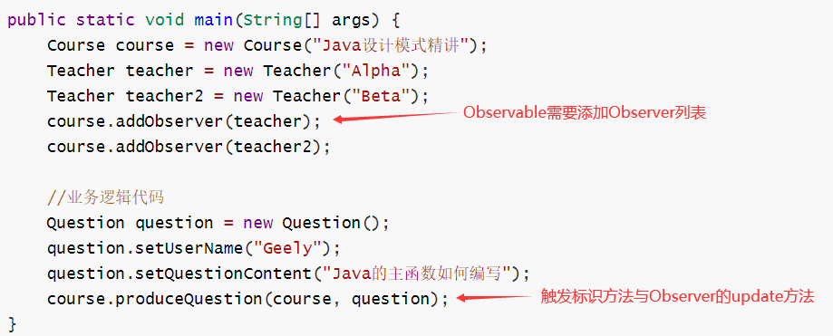

# 观察者模式

- 概念

  - 当一个对象状态改变，给依赖对象广播通知。

- 角色

  - 被观察类

      

    - 需要继承Observable
    - setChanged()标注数据发生变化
    - notifyObservers()调用Observer的update方法，可以传参数

  - 观察类

    

    - 需要实现Observer接口
    - 实现update方法
      - 可以获取到Observable对象
      - 可以获取到传过来的对象

  - 测试类

    

    - addObserver方法：添加Observer对象列表