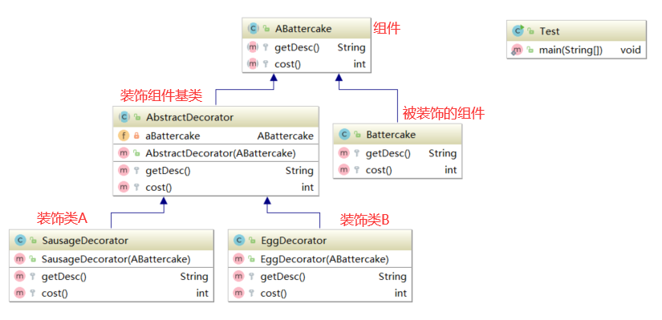
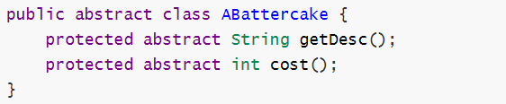
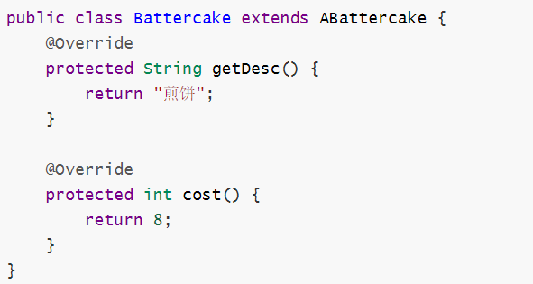
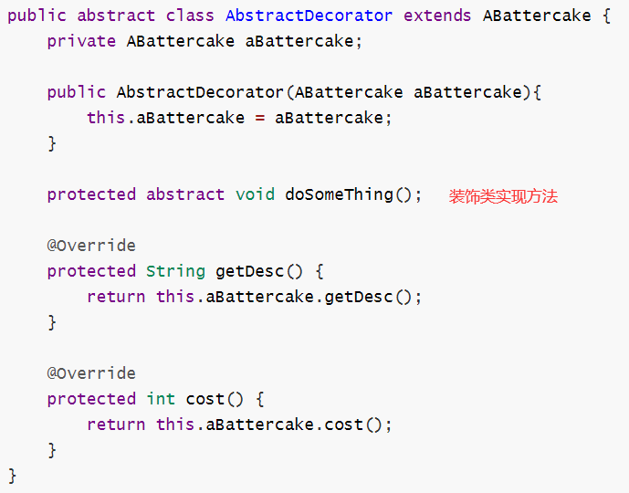
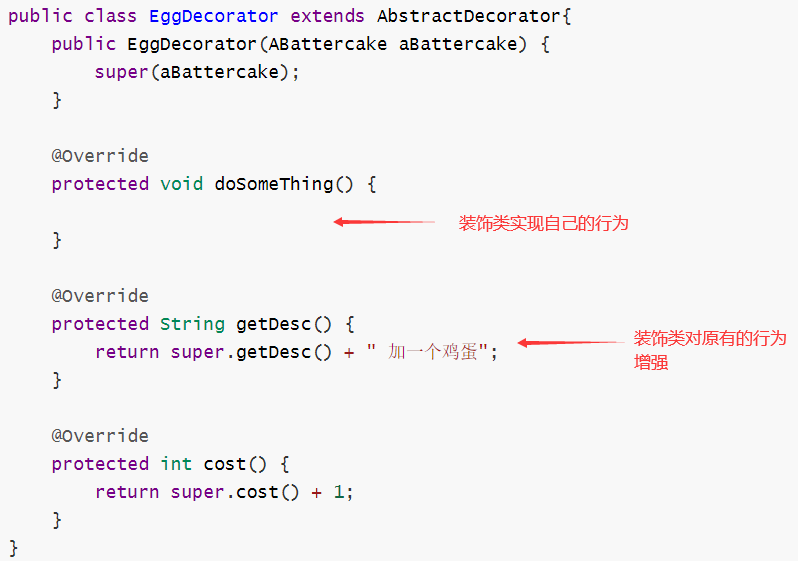
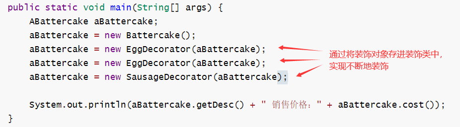

# 装饰者模式

- 概念

  - 当我们想要给某个类灵活地扩展行为，灵活指的是随意某个时机，随意的行为组合方式。

  - UML图

    

- 角色

  - 组件

    

  - 被装饰的组件

    

    - 需要继承组件抽象类

  - 装饰组件基类

    

    - 以参数方式接收被装饰对象

  - 装饰类

    

    - 新增行为或增强行为

  - 测试类

    