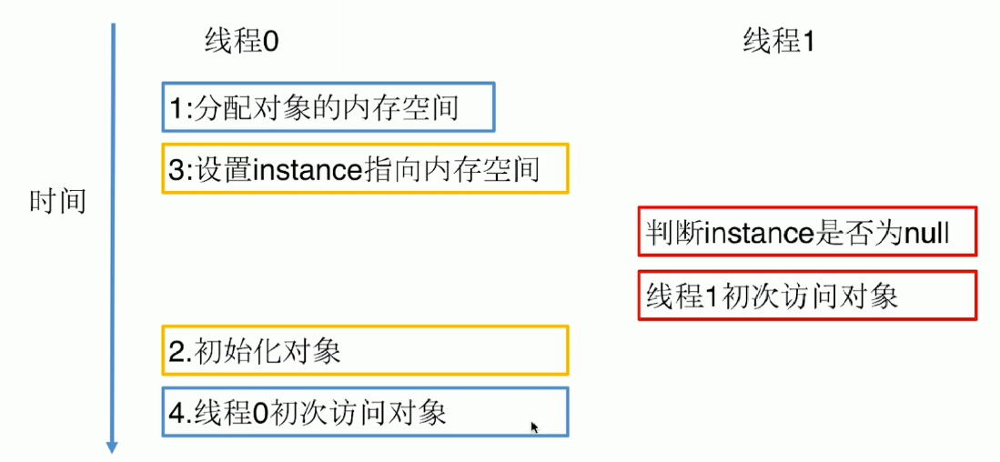

# 单例模式

单例模式，内存只有一个对象，节省资源。有些对象只需一个：线程池、缓存、硬件设备（打印机），多个可能造成结果混乱。

## 饿汉式单例

特点：构造函数改为私有，不让外面调用；final要求在类加载完成时就完成赋值。类在加载的时候就实例化对象，使用方便安全。

缺点：可能实例化的对象根本就没用到，容易产生垃圾对象

核心代码如下：

```java
    public class Singleton {
        private final static Singleton singleton = new Singleton();
        private Singleton(){}
        public static Singleton getInstance(){
            return singleton;
        }
    }
```

## 懒汉式单例

特点：类在调用时才实例化对象。

缺点：加了synchronized之后线程安全，但是效率很低

核心代码如下：

```java
    public class Singleton {
        private static Singleton singleton;
        private Singleton(){}

        public static synchronized Singleton getInstance(){
            if(singleton==null){
                singleton = new Singleton();
            }
            return singleton;
        }
    }
```

## 双重检查单例

特点：双重检查在兼顾懒汉模式优点的情况下，缩小了锁的范围，提高了效率。

```java
public class LazyDoubleCheckSingleton {
    private volatile static LazyDoubleCheckSingleton lazyDoubleCheckSingleton = null;
    private LazyDoubleCheckSingleton(){
    }
    public static LazyDoubleCheckSingleton getInstance(){
        if(lazyDoubleCheckSingleton == null){
            synchronized (LazyDoubleCheckSingleton.class){
                if(lazyDoubleCheckSingleton == null){
                    lazyDoubleCheckSingleton = new LazyDoubleCheckSingleton();
                }
            }
        }
        return lazyDoubleCheckSingleton;
    }

}
```

它要添加``volatie``修饰，``volatie``修饰会禁止重排序；因为对象赋值过程可拆分为三个步骤：

1. 分配内存给这个对象
2. 初始化对象
3. 设置lazyDoubleCheckSingleton指向内存地址

但是2，3可能会重排序，颠倒顺序。在多线程时，如果顺序颠倒，线程的访问就可能判断有对象，又获取不到对象。

  

## 登记式单例

使用内部类初始化对象，是饿汉模式的改良版，只有在调用的时候才加载；加载的时候就初始化，重排序不会被其他线程看到（加了锁）

```java
public class Singleton {  
    private static class SingletonHolder {  
    	private static final Singleton INSTANCE = new Singleton();  
    }  
    private Singleton (){}  
    public static final Singleton getInstance() {  
    	return SingletonHolder.INSTANCE;  
    }  
}
```

## 枚举单例

推荐的写法。可以防止序列化、反射破坏单例模式（饿汉模式）。

```java
public enum EnumInstance {
    INSTANCE;
    private Object data;

    public Object getData(){
        return data;
    }

    public void setData(Object data){
        this.data = data;
    }

    public static EnumInstance getInstance(){
        return INSTANCE;
    }

}
```

## ThreadLocal“单例”

其他单例处理多线程问题是通过时间换空间的方式，而ThreadLocal则用空间换时间。每个线程获取的对象都是单独的，互不相同、互不干扰。属于伪单例。

```java
public class ThreadLocalInstance {
    
    private static final ThreadLocal<ThreadLocalInstance> threadLocalInstanceThreadLocal
            = new ThreadLocal<ThreadLocalInstance>(){
        protected ThreadLocalInstance initialValue(){
            return new ThreadLocalInstance();
        }
    };
    private ThreadLocalInstance(){

    }

    public static ThreadLocalInstance getInstance(){
        return threadLocalInstanceThreadLocal.get();
    }

}
```

```java
ThreadLocalInstance instance = ThreadLocalInstance.getInstance();
```

## 破坏单例模式：序列化

通过序列化，再反序列化，获得的将不是同一个对象。

```java
  public static void main(String[] args) throws IOException, ClassNotFoundException {
        HungrySingleton instance = HungrySingleton.getInstance();
        ObjectOutputStream oos = new ObjectOutputStream(new FileOutputStream("single_file"));
        oos.writeObject(instance);

        File file = new File("single_file");
        ObjectInputStream ois = new ObjectInputStream(new FileInputStream(file));

        HungrySingleton newInstance = (HungrySingleton) ois.readObject();

        System.out.println(instance);
        System.out.println(newInstance);
        System.out.println(instance == newInstance);
    }
```

因为反序列化事通过反射的方式获取对象，只有在被序列化的类中添加``readResolve``方法，才能获取到同个对象

```java
private Object readResolve(){
    return hungrySingleton;
}
```

因为``readObject``中会旁段是否有存在``readResolve``方法，有的话则用其返回的值。

### 源码解析

```java
...
        if (obj != null &&
            handles.lookupException(passHandle) == null &&
            desc.hasReadResolveMethod())
        {
            Object rep = desc.invokeReadResolve(obj);
            if (unshared && rep.getClass().isArray()) {
                rep = cloneArray(rep);
            }
            if (rep != obj) {
                handles.setObject(passHandle, obj = rep);
            }
        }
...
```

## 破坏单例模式：反射

通过反射获取实例，获得的将不是同一个对象。

```java
...
		Class objectClass = HungrySingleton.class;
        Constructor constructor = objectClass.getDeclaredConstructor();
        constructor.setAccessible(true);
        HungrySingleton newInstance = (HungrySingleton) constructor.newInstance();
...
```

饿汉单例模式反射防御：在构造方法中添加判断

```java
    private HungrySingleton(){
        if(hungrySingleton != null){
            throw new RuntimeException("单例构造器禁止反射调用");
        }
    }
```

类加载的时候生成实例的单例模式可以通过判断防御反射攻击，如果是懒汉式的，将没有完好的防御方式。

```java
public class LazySingleton {
    private static LazySingleton lazySingleton = null;
    private static boolean flag = true;

    private LazySingleton(){
        if(flag){
            flag = false;
        }else{
            throw new RuntimeException("单例构造器禁止反射调用");
        }
    }

    public synchronized static LazySingleton getInstance(){
        if(lazySingleton == null){
            lazySingleton = new LazySingleton();
        }
        return lazySingleton;
    }

}
```

虽然flag阻止了第二次执行构造函数，但flag的值也可以通过反射修改。

## 单例容器

当系统中单例对象非常多的时候，可以用一个容器统一管理。但存在线程安全问题，可以使用HashTable（性能差），根据业务场景决定是否考虑线程安全。

```java
public class ContainerSingleton {

    private ContainerSingleton(){}

    private static Map<String, Object> singletonMap = new HashMap<String, Object>();

    public static void putInstance(String key, Object instance){
        if(StringUtils.isNotBlank(key) && instance != null){
            if(singletonMap.containsKey(key)){
                singletonMap.put(key, instance);
            }
        }
    }

    public static Object getInstance(String key){
        return singletonMap.get(key);
    }

}
```

[源码](..\SourceCode\defign_pattern\src\main\java\com\geely\design\pattern\creational\singleton)  

### 源码解析

Runtime.java  饿汉式

Desktop.java  -- getDesktop() 容器单例

Spring单例限定的是应用程序的上下文，这种单例限定氛围是类加载器的控件里。

AbstractFactoryBean -- getObject()

ErrorContext   ThreadLocal